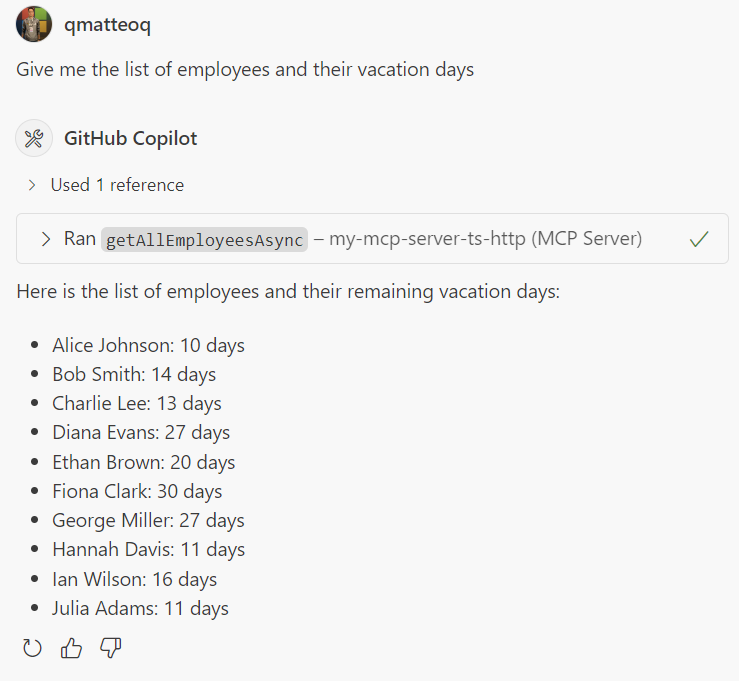

# 🌴 Employee Vacations MCP Server Sample (Streamable HTTP version) - C#

Welcome to the **Employee Vacations MCP Server Sample (Streamable HTTP version)*. In this sample, you will learn how to deploy the MCP Server and then add it to Microsoft Copilot Studio.
This sample simulates the scenario of using MCP to connect an internal LOB system to an agent created in Copilot Studio. In this case, the sample mimics an internal application to manage employee vacations.

This MCP Server has multiple tools available:

- `getAllEmployeesAsync` | Get the list of all the available employees and their vacation days
- `getVacationDaysLeftAsync` | Get the number of vacation days left for as specific employee
- `chargeVacationDaysAsync` | Charge vacation days for a specific employee

This is the C# version. For the TypeScript version, please check the [employeevacations-http-typescript](../employeevacations-http-typescript/) folder.

## ⚙️ Prerequisites

- Visual Studio Code ([link](https://code.visualstudio.com/download))
- The .NET SDK ([link](https://dotnet.microsoft.com/download))
- The Azurite extension for Visual Studio Code ([link](https://marketplace.visualstudio.com/items?itemName=Azurite.azurite))
- GitHub account

## 🚀 Minimal path to awesome

1. Clone this repository by running `git clone https://github.com/microsoft/copilot-studio-mcp/` in your terminal
1. Open Visual Studio Code on the subfolder `samples/employeevacations-http-csharp`
1. Launch the Azurite emulator for the Table service by running the command `Azurite: Start Table Service` in the command palette (press `ctrl` + `shift` + `P` or `cmd` + `shift` + `P` on Mac)
1. Open the terminal and navigate to the same folder
1. Run `dotnet run build` to start the server
1. Select `PORTS` at the top of the Visual Studio Code Terminal

    

1. Select the green `Forward a Port` button

    

1. Enter `5248` as the port number (this should be the same as the port number you see when you ran the command in step 5). You might be prompted to sign in to GitHub, if so please do this, since this is required to use the port forwarding feature.
1. Right click on the row you just added and select `Port visibility` > `Public` to make the server publicly available
1. Ctrl + click on the `Forwarded address`, which should be something like: `https://something-3000.something.devtunnels.ms`
1. Select `Copy` on the following pop-up to copy the URL

     

2.  Open to the browser of your choice and paste the URL in the address bar and hit enter

If all went well, you will see the following error message:

```json
{"error":{"code":-32000,"message":"Not Acceptable: Client must accept text/event-stream"},"id":"","jsonrpc":"2.0"}
```

Don't worry - this error message is nothing to be worried about!

## 👨‍💻 Use the Employee Vacations MCP Server in Visual Studio Code / GitHub Copilot

To use the Employee Vacations MCP Server, you need to use the URL of your server (can be either your devtunnel URL or your deployed Azure Container App) with the `/mcp` part at the end and add it as an MCP Server in Visual Studio Code.

1. Press either `ctrl` + `shift` + `P` (Windows/Linux) or `cmd` + `shift` + `P` (Mac) and type `MCP`
1. Select `MCP: Add Server...`
1. Select `HTTP (HTTP or Server-Sent Events)`
2. Paste the URL of your server in the input box
3. Press `Enter`
4. Enter a name for the server, for instance `JokesMCP`
5. Select `User Settings` to save the MCP Server settings in your user settings
6. Open `GitHub Copilot`
7. Switch from `Ask` to `Agent`
8. Make sure the `EmployeeVacationMCP` server actions are enabled
9. Ask the following question:

    ```text
    Give me the list of employees and their vacation days
    ```

This should give you a response like this:



Now you have added the `EmployeesVacationMCP` server to Visual Studio Code!


