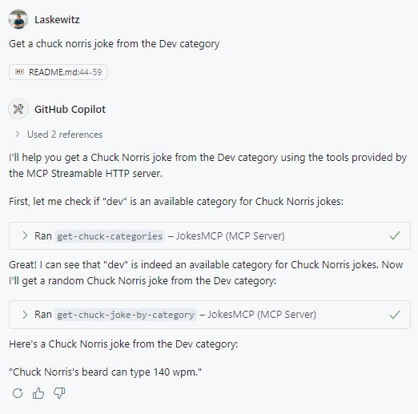

# 😁 Jokes MCP Server Sample (Streamable HTTP version)

Welcome to the Jokes MCP Server. This server has multiple tools available:

- `get-chuck-joke` | Get a random Chuck Norris joke
- `get-chuck-joke-by-category` | Get a random Chuck Norris joke by category
- `get-chuck-categories` | Get all available categories for Chuck Norris jokes
- `get-dad-joke` | Get a random dad joke

## ⚙️ Prerequisites

- Visual Studio Code ([link](https://code.visualstudio.com/download))
- Node v22 (ideally installed via [nvm for Windows](https://github.com/coreybutler/nvm-windows))
- GitHub account
- Azure Developer CLI ([link](https://learn.microsoft.com/azure/developer/azure-developer-cli/install-azd))

## 🚀 Minimal path to awesome

1. Clone this repository by running `git clone https://github.com/Laskewitz/MCP-Streamable-HTTP.git` in your terminal
1. Open Visual Studio Code and open the cloned folder
1. Open the terminal and navigate to the cloned folder
1. Run `npm install`
1. Run `npm run build && npm run start`

    

1. Select `PORTS` at the top of the Visual Studio Code Terminal

    

1. Select the green `Forward a Port` button

    

1. Enter `3000` as the port number (this should be the same as the port number you see when you ran the command in step 5). You might be prompted to sign in to GitHub, if so please do this, since this is required to use the port forwarding feature.
1. Right click on the row you just added and select `Port visibility` > `Public` to make the server publicly available
1. Ctrl + click on the `Forwarded address`, which should be something like: `https://something-3000.something.devtunnels.ms`
1. Select `Copy` on the following pop-up to copy the URL

     

1. Open to the browser of your choice and paste the URL in the address bar, type `/mcp` behind it and hit enter

If all went well, you will see the following error message:

```json
{"jsonrpc":"2.0","error":{"code":-32000,"message":"Method not allowed."},"id":null}
```

Don't worry - this error message is nothing to be worried about!

## 🌎 Host on Azure Container Apps

Make sure to login to Azure Developer CLI if you haven't done that yet.

```azurecli
azd auth login
```

Run the following command in the terminal:

```azurecli
azd up
```

After running the `azd up` command, it will take a couple of minutes before the server has been deployed. When it's done - you should be able to go to the URL that's listed at the end and add `/mcp` to the end of that URL. 


You should again see the following error:

```json
{"jsonrpc":"2.0","error":{"code":-32000,"message":"Method not allowed."},"id":null}
```

Again - don't worry - this error message is nothing to be worried about!

## 👨‍💻 Use the Jokes MCP Server in Visual Studio Code / GitHub Copilot

To use the Jokes MCP Server, you need to use the URL of your server (can be either your devtunnel URL or your deployed Azure Container App) with the `/mcp` part at the end and add it as an MCP Server in Visual Studio Code.

1. Press either `ctrl` + `shift` + `P` (Windows/Linux) or `cmd` + `shift` + `P` (Mac) and type `MCP`
1. Select `MCP: Add Server...`
1. Select `HTTP (HTTP or Server-Sent Events)`
1. Paste the URL of your server in the input box (make sure `/mcp` in the end is included)
1. Press `Enter`
1. Enter a name for the server, for instance `JokesMCP`
1. Select `User Settings` to save the MCP Server settings in your user settings
1. Open `GitHub Copilot`
1. Switch from `Ask` to `Agent`
1. Make sure the `JokesMCP` server actions are enabled
1. Ask the following question:

    ```text
    Get a chuck norris joke from the Dev category
    ```

This should give you a response like this:



Now you have added the `JokesMCP` server to Visual Studio Code!
